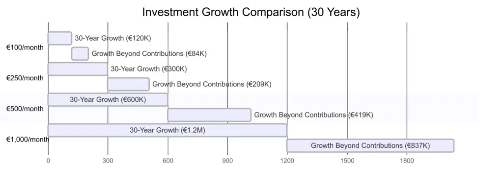
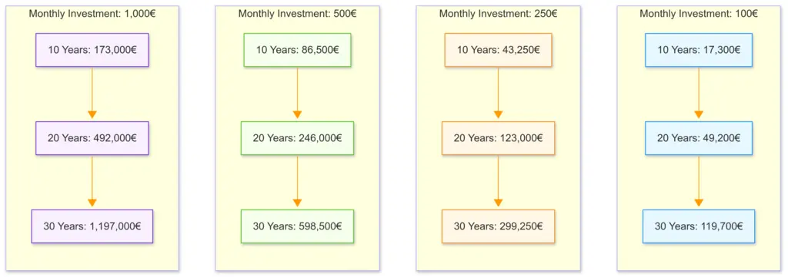
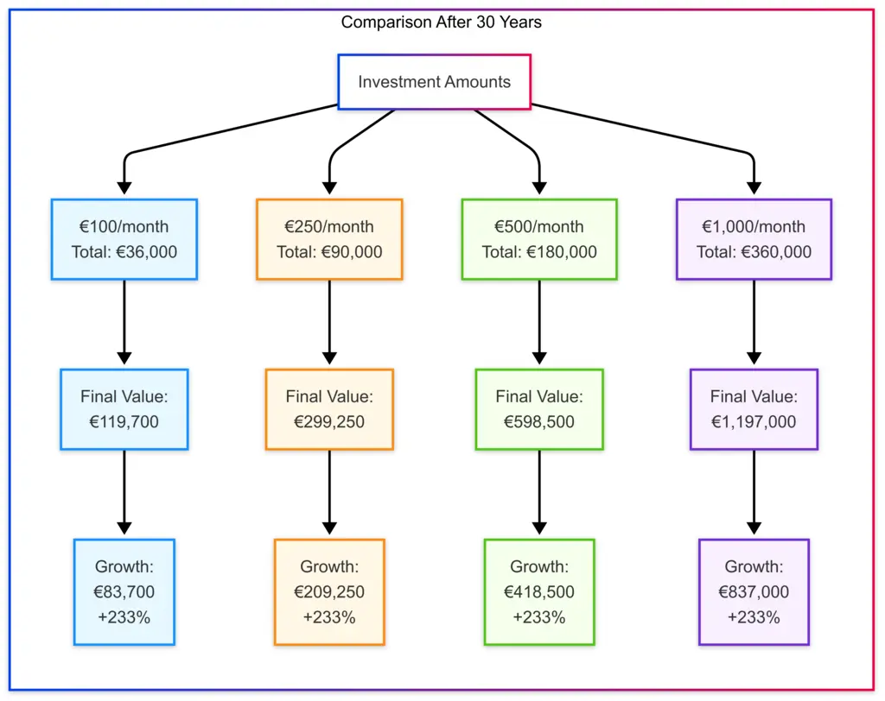

# Intro Guide to Index Investing

This guide aims to demystify index investing for beginners without overwhelming you with complex financial jargon. Whether you're just starting your investment journey or looking to understand the fundamentals of index investing, you'll find straightforward explanations, practical advice, and visual representations that illustrate the power of consistent, long-term investing.

By focusing on major market indexes, simple investment strategies, and the substantial effects of compound growth, this guide will help you build confidence to take those first steps toward financial growth and your future.

Each section includes a "[TL;DR]" summary, making it easy to grasp key the concept quickly while providing enough depth for those who want to learn more.

# Table of Contents

- [Intro Guide to Index Investing](#intro-guide-to-index-investing)
- [Table of Contents](#table-of-contents)
  - [What are and why should I care about a Market Index?](#what-are-and-why-should-i-care-about-a-market-index)
  - [The Major Market Indexes](#the-major-market-indexes)
    - [United States:](#united-states)
    - [Europe:](#europe)
  - [How to Invest in Market Indexes](#how-to-invest-in-market-indexes)
  - [Why Bother? - The Power of Regular Investing](#why-bother---the-power-of-regular-investing)
  - [Understanding Dividend Stocks \& Reinvestment](#understanding-dividend-stocks--reinvestment)
  - [About Leveraging \& Margin Calls](#about-leveraging--margin-calls)
  - [The Importance of Diversification](#the-importance-of-diversification)
  - [Common Investing Mistakes Beginners Should Avoid](#common-investing-mistakes-beginners-should-avoid)
  - [Investment Growth In Pictures](#investment-growth-in-pictures)
    - [Growth Over Time](#growth-over-time)
    - [Investment Growth Comparison After 30 Years](#investment-growth-comparison-after-30-years)
    - [Growth Over Time - different initial principle](#growth-over-time---different-initial-principle)
    - [Investment Comparison After 30 Years](#investment-comparison-after-30-years)

## What are and why should I care about a Market Index?

**What is an Index?**

A market index is a collection of stocks/shares or other [securities] that represents a specific segment of the financial market, designed to track its overall performance and serve as a benchmark for investors.

**Are Market Indexes respected?**

Market indexes are widely respected and trusted by investors, financial professionals, and economists as reliable indicators of market performance due to their transparent methodologies, long-established track records, and independence from individual investment biases.

## The Major Market Indexes

Different regions have different centers of finance. They change over history. Historically for example in the 1800s it was the Dutch. Then the British took over and it was seated in London. Following the two world wars it moved to the US. 

Investors that manage a lot of capital are very risk adverse. This is why the following indexes and exchanges are still around over many many years.

### United States:

- **S&P 500 (SPX)**
  * Companies are selected by a committee based on market cap (must exceed $14.5 billion), profitability, and liquidity
  * Changes occur as needed, not on a fixed schedule, ensuring the index represents leading US companies
  * Reference: [https://www.spglobal.com/spdji/en/indices/equity/sp-500/](https://www.spglobal.com/spdji/en/indices/equity/sp-500/)

- **Dow Jones Industrial Average (DJI)**
  * Companies selected by editors of The Wall Street Journal based on reputation, growth, and investor interest
  * No specific rules for inclusion/exclusion, focused on maintaining representation of the US economy
  * Reference: [https://www.spglobal.com/spdji/en/indices/equity/dow-jones-industrial-average/](https://www.spglobal.com/spdji/en/indices/equity/dow-jones-industrial-average/)

- **NASDAQ Composite (IXIC)**
  * Automatically includes all companies listed on the NASDAQ exchange
  * Companies are added/removed simply based on their NASDAQ listing status
  * Reference: [https://www.nasdaq.com/market-activity/index/comp](https://www.nasdaq.com/market-activity/index/comp)

- **Russell 2000 (RUT)**
  * Rebalanced annually every June
  * Automatically includes the smallest 2000 companies from the Russell 3000 index
  * Reference: [https://www.ftserussell.com/products/indices/russell-us](https://www.ftserussell.com/products/indices/russell-us)

### Europe:

- **FTSE 100 (UKX)**
  * Companies are ranked by market capitalization every quarter
  * Automatic entry for companies reaching 90th place or above, company is bumped/exit if falling below 111th place
  * Reference: [https://www.ftserussell.com/products/indices/](https://www.ftserussell.com/products/indices/uk)

- **EURO STOXX 50 (SX5E)**
  * Reviewed annually in September
  * Selection based on free-float market cap of eligible companies from 8 Eurozone countries
  * Reference: [https://www.stoxx.com/index-details?symbol=SX5E](https://www.stoxx.com/index-details?symbol=SX5E)

- **DAX (GDAXI)**
  * Reviewed quarterly
  * Companies must be listed on Frankfurt Exchange with sufficient free float and exchange volume
  * Reference: [https://www.dax-indices.com/index-details?isin=DE0008469008](https://www.dax-indices.com/index-details?isin=DE0008469008)

- **CAC 40 (FCHI)**
  * Reviewed quarterly by an independent committee
  * Selection based on market cap and trading volume, ensuring representation of key sectors
  * Reference: [https://www.euronext.com/en/products/indices/FR0003500008-XPAR](https://www.euronext.com/en/products/indices/FR0003500008-XPAR)

> **TL;DR**

Major indexes like S&P 500 and FTSE 100 track the biggest companies in their markets. They're maintained by committees that add/remove companies based on size and performance, making them stable benchmarks for investors.

## How to Invest in Market Indexes

You don't buy indexes directly—instead, you invest in them through financial products designed to mirror their performance. The simplest way is through Exchange-Traded Funds (ETFs) or Index Funds. These are available through most investment platforms, including apps like Robinhood, Schwab, Revolut, as well as traditional brokerages and banks.

To get started, you'll need to open an investment account, deposit money, and search for the ETF ticker symbol (like "SPY" for S&P 500 or "ISF" for FTSE 100).

You can buy as little as one share, or even fractional shares on many platforms. Index funds work similarly but are purchased at the end of the trading day. Both options typically have very low fees compared to actively managed investments, making them ideal for beginners who want broad market exposure without needing to pick individual stocks yourself.

> **TL;DR**

You don't buy indexes directly. Instead, use apps like Robinhood etc to purchase ETFs (like SPY for S&P 500) that track these indexes. You can start with just one share or even less.

 

## Why Bother? - The Power of Regular Investing

Investing **1,000** Euro each month can build substantial wealth over time through the power of compound returns. Here's how your investment could grow, assuming an average annual return of 7% (a reasonable long-term average for diversified index investments btw):

**After 10 years:**
* Total amount invested: 120,000 Euro (1,000 × 12 × 10)
* Approximate value: 173,000 Euro
* Growth beyond the initial contributions: 53,000 Euro

**After 20 years:**
* Total amount invested: 240,000 Euro (1,000 × 12 × 20)
* Approximate value: 492,000 Euro
* Growth beyond the initial contributions: 252,000 Euro

**After 30 years:**
* Total amount invested: 360,000 Euro (1,000 × 12 × 30)
* Approximate value: 1,197,000 Euro
* Growth beyond the contributions: 837,000 Euro

This demonstrates how **time** becomes your most powerful investment tool. While you've only invested 360,000 Euro over 30 years, your money has worked for you to generate an additional 837,000 Euro in returns. This example illustrates why starting early and investing consistently, even with modest amounts, can lead to significant wealth accumulation over time.

Note: These figures are simplified projections. Actual returns will vary year to year, and past performance doesn't guarantee future results. Just like every ad on the telly says.

> **TL;DR**

Investing **1,000** Euro monthly could grow to **173,000€** after 10 years, **492,000€** after 20 years, and nearly **1.2 million Euro** after 30 years (assuming 7% returns). **Time is your biggest advantage**

## Understanding Dividend Stocks & Reinvestment

Some stocks/shares pay you a portion of their profits regularly these payments are called dividends. Think of it as getting a small "thank you" payment several times a year just for owning shares in a company.

Many established companies in indexes like the S&P 500 or FTSE 100 pay dividends, typically ranging from 1% to 5% of your investment annually. Companies that pay dividendws are more common on some stock exchanges than others. FTSE ok, NASDAQ not so much etc.

**Why Dividends Matter:**

When you own dividend stocks (shares in a company that pay a dividend), you have two ways to grow your money: the stock price can increase (capital appreciation) AND you receive regular dividend payments (income).

**Reinvesting Dividends: The Growth Accelerator**

Instead of taking these dividend payments as cash, you can choose to automatically buy more shares with that money. This is called "dividend reinvestment."

This is a powerful strategy because:

* Increases your share count without requiring additional money from your pocket
* Creates a snowball effect as your growing number of shares generates even more dividends
* Has historically accounted for a significant portion of total stock market returns

**Is knowing about dividends relevant for beginners?**

Absolutely! Many index ETFs (Exchange Trading Funds) offer versions that automatically reinvest dividends. For someone investing **1,000 Euro** monthly in your example, reinvesting dividends could add approximately 15-20% more to your final amount over 30 years compared to taking the dividends as cash money.

This approach combines the stability of regular income with thosee longer term benefits of compounding. So making it particularly valuable for younger/earlier investors with time on their side. You.

> **TL;DR**

Some shares/stocks pay you regular cash (dividends). Reinvesting these payments to buy more shares creates a snowball effect that could add 15-20% more to your returns over time without any extra money from your pocket.

## About Leveraging & Margin Calls

Leveraging means borrowing money to invest more than you actually have, like putting down 25% and borrowing the rest. This can amplify your gains when markets rise (investing 1,000 to control 4,000 in stocks means a 10% market gain creates a 40% return on your money). However, **losses are equally magnified**, and if your investments drop significantly, you'll face a "margin call" - a demand to deposit more money immediately or have your shares (known as positions) sold automatically, often at the worst possible time.

Leveraging works best with a risk-averse, diversified portfolio that can withstand market volatility without triggering these forced sales via a margin call. It is a very risky stratagy without understanding the risks and how the professionals hedge against risk.

The end of a stock market bubble begins with a slew of margin calls that just snowball.

For beginners, it's much wiser to avoid leverage until you've built experience, substantial savings, and a very solid understanding of market cycles - because the market, just like real estate and history just keeps repeating itself. Cycling. 

If you do explore leveraging later, start with small amounts and never leverage money you cannot afford to lose because it can be very tempting when everything looks rosy. When it goes wrong it can go very wrong very fast.

> **TL;DR**

Leveraging multiplies both potential gains and losses by borrowing to invest more. Margin calls force you to add money when investments fall. Only consider this advanced strategy with a stable, diversified portfolio and money you can afford to lose.

## The Importance of Diversification

Diversification means spreading your investments across different assets rather than putting all your money in one place. Think of it as not carrying all your eggs in one basket. When you diversify, you invest across various companies, sectors, regions, and sometimes different types of assets (shares, bonds, fineart, gold, real estate...)

This strategy helps protect your money because when some investments perform poorly, others may do well, smoothing out your overall returns. Index funds are naturally diversified. That S&P 500 ETF instantly gives you ownership in 500 different companies across all major industries. Very risk adverse.

For beginners, achieving good diversification is as simple as investing in a few broad-based index funds covering different regions (like US, Europe, and emerging markets) rather than trying to pick individual winners.

> **TL;DR**

Spread your investments across many companies and regions instead of betting on just a few. Index funds automatically give you this diversification, reducing your risk without reducing potential returns.

## Common Investing Mistakes Beginners Should Avoid

1. **Trying to time the market:** Attempting to buy at the "perfect" low point or sell at the peak rarely works. Consistent investing regardless of market conditions (called outlay-cost averaging) typically outperforms timing attempts long term.

2. **Checking investments too frequently:** Daily price movements cause unnecessary anxiety and can trigger emotional decisions. For long-term investing, checking monthly or quarterly is more than enough.

3. **Chasing past performance:** Last year's winning investments often underperform in following years. Focus on your long-term strategy rather than jumping between hot of the day investments.

4. **Paying high fees:** Even small differences in fees (0.1% vs 1%) can reduce your overall wealth by thousands over the decades. Always consider fees/costs, expense ratios before picking where to buy thru for the investing.

5. **Selling during market downturns:** Market drops are normal and temporary. Selling during these periods locks in those losses rather than holding your nerve and giving investments time to recover.

> **TL;DR**

Avoid these common mistakes: trying to time the market, checking investments daily, chasing trends, paying high fees, and panic-selling during downturns. Stick to your plan and think long-term.

 

## Investment Growth In Pictures

### Growth Over Time

### Investment Growth Comparison After 30 Years

 

### Growth Over Time - different initial principle

### Investment Comparison After 30 Years

[TL;DR]: https://en.wikipedia.org/wiki/Wikipedia:Too_long;_didn%27t_read

[securities]: https://www.investopedia.com/terms/s/security.asp

[securitie]: https://www.investopedia.com/terms/s/security.asp

