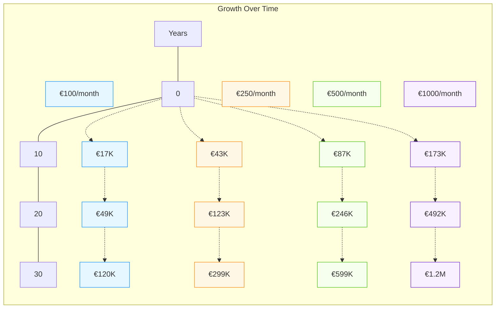
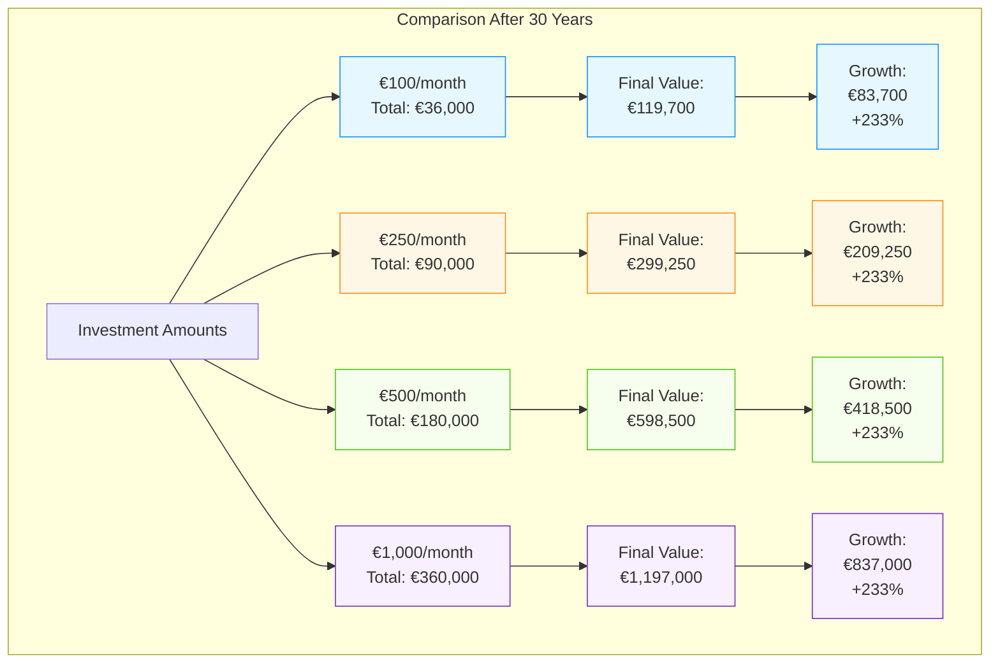

# A note on the diagrams/graphs

Below you'll find several diagrams illustrating potential investment growth over time based on different monthly contributions.

These markdown versions below represent the actual source of what you see and so complement the actual image renders in [README.md](README.md)

These visuals were created using [Mermaid Markdown](https://mermaid.js.org), a text-based syntax for generating diagrams.

For more details on creating your own diagrams with Mermaid, checkout the official documentation: [mermaid.js.org](https://mermaid.js.org).

## Investment Growth In Pictures

### Growth Over Time

### Investment Growth Comparison After 30 Years

```mermaid

%%{init: {'theme': 'default', 'themeVariables': { 'primaryColor': '#42b983', 'primaryTextColor': '#fff', 'primaryBorderColor': '#42b983', 'lineColor': '#ff9900', 'tertiaryColor': '#fff' }}}%%
graph TD
    subgraph "Monthly Investment: 100€" 
    style A1 fill:#e6f7ff,stroke:#1890ff
    style A2 fill:#e6f7ff,stroke:#1890ff
    style A3 fill:#e6f7ff,stroke:#1890ff
    A1[10 Years: 17,300€] --> A2[20 Years: 49,200€]
    A2 --> A3[30 Years: 119,700€]
    end
    
    subgraph "Monthly Investment: 250€"
    style B1 fill:#fff7e6,stroke:#fa8c16
    style B2 fill:#fff7e6,stroke:#fa8c16
    style B3 fill:#fff7e6,stroke:#fa8c16
    B1[10 Years: 43,250€] --> B2[20 Years: 123,000€]
    B2 --> B3[30 Years: 299,250€]
    end
    
    subgraph "Monthly Investment: 500€"
    style C1 fill:#f6ffed,stroke:#52c41a
    style C2 fill:#f6ffed,stroke:#52c41a
    style C3 fill:#f6ffed,stroke:#52c41a
    C1[10 Years: 86,500€] --> C2[20 Years: 246,000€]
    C2 --> C3[30 Years: 598,500€]
    end
    
    subgraph "Monthly Investment: 1,000€"
    style D1 fill:#f9f0ff,stroke:#722ed1
    style D2 fill:#f9f0ff,stroke:#722ed1
    style D3 fill:#f9f0ff,stroke:#722ed1
    D1[10 Years: 173,000€] --> D2[20 Years: 492,000€]
    D2 --> D3[30 Years: 1,197,000€]
    end

```

### Growth Over Time - different initial principle

```mermaid

gantt
    title Investment Growth Comparison (30 Years)
    dateFormat X
    axisFormat %s
    
    section €100/month
    30-Year Growth (€120K): 0, 120
    Growth Beyond Contributions (€84K): 120, 204
    
    section €250/month
    30-Year Growth (€300K): 0, 300
    Growth Beyond Contributions (€209K): 300, 509
    
    section €500/month
    30-Year Growth (€600K): 0, 600
    Growth Beyond Contributions (€419K): 600, 1019
    
    section €1,000/month
    30-Year Growth (€1.2M): 0, 1200
    Growth Beyond Contributions (€837K): 1200, 2037
```

### Investment Comparison After 30 Years

